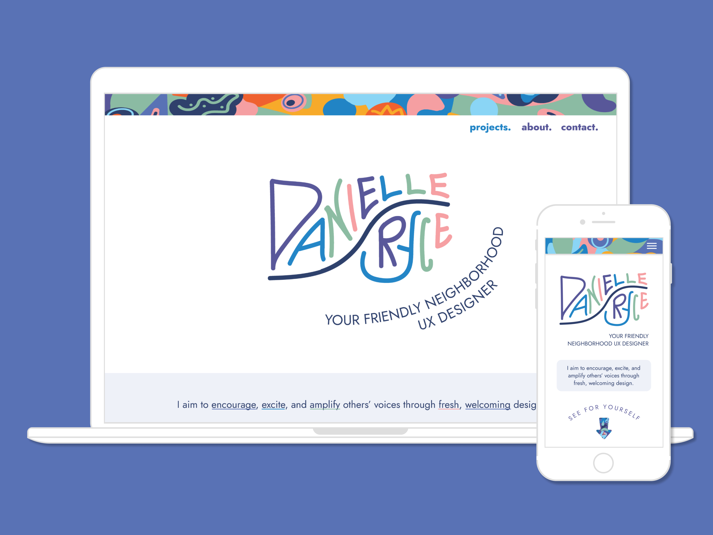

# Danielle Ryce Portfolio Site

Portfolio website for UX designer using her designs and built with ReactJS.

---

[Live Website: DanielleRyce.com](https://rotationexchange.com/)

This is a portfolio website commisioned by a UX designer. It features a landing page, about page, and four case study pages. The case studies are the most complex components of the website given that they include various types of carousels, dropdowns, lightboxes, and animations.

### Technology used:

- React
- JSX
- CSS
- Responsive design

